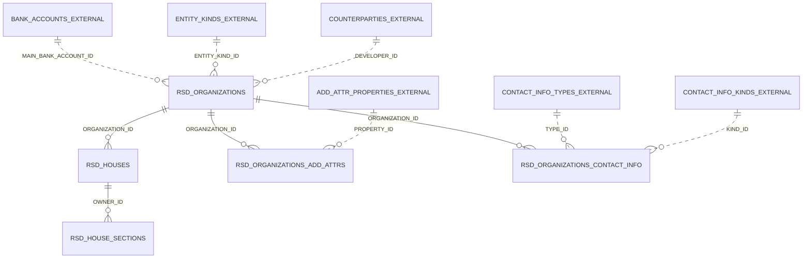

# Специфікація міграції — батч 001: Будинки (Catalog.RSD_Дома)

## 1. Application Overview

- **APP_NAME**: ERP (застосунок 122, workspace BAS_REVERSE)
- **MODULE_CONTEXT**: Реєстр будинків забудовника з підпорядкованими секціями
  та довідник організацій, на які посилаються будинки. Базовий НСІ-контур для
  подальших документних кластерів ERP.
- **Source objects**: `Catalog.RSD_Дома` (корінь), `Catalog.RSD_Секції`
  (підпорядкований), `Catalog.Организации` (посилання, глибина 1)
- **Batch**: 001, перший батч міграції; глосарій порожній — усі рядки §8 нові.

## 2. Data Model

**Entity: RSD_HOUSES** (source: Catalog.RSD_Дома, «Будинки»)

| Column | Oracle Type | Null | Default | Source (1C) | Notes |
|---|---|---|---|---|---|
| ID | NUMBER GENERATED ALWAYS AS IDENTITY | N | — | Ссылка | PK |
| LEGACY_REF | VARCHAR2(36) | N | — | Ссылка (UUID) | unique; звірка міграції |
| CODE | VARCHAR2(9) | N | — | Код | unique (CheckUnique=true); Autonumbering → застосунок призначає, поле редаговане |
| NAME | VARCHAR2(150 CHAR) | N | — | Наименование | primary display; label uk «Будинки» |
| ORGANIZATION_ID | NUMBER | Y | — | Организация | FK → RSD_ORGANIZATIONS; label uk перекладено (uk-синонім відсутній) → §9 |
| HOUSE_ADDRESS | VARCHAR2(300 CHAR) | N | — | АдресДома | required (FillChecking=ShowError); **конфлікт імені й синоніма** (ім'я «адрес», синонім ru «Область») → §9 |
| IS_ACTIVE | BOOLEAN | N | TRUE | Активность | label uk перекладено → §9 |
| ITEM_NO | VARCHAR2(30 CHAR) | Y | — | Номер | label uk перекладено → §9 |
| IS_HOUSE_ZERO | BOOLEAN | N | FALSE | Дом0 | label uk «Будинок 0 (LOT 100)»; ru/uk розбіжність LOD/LOT → §9 |
| IS_DELETED | BOOLEAN | N | FALSE | ПометкаУдаления | soft delete, фільтри типово приховують |
| CREATED_AT / CREATED_BY / UPDATED_AT / UPDATED_BY | TIMESTAMP / VARCHAR2(255) | N | — | — | аудит, конвенція APEX |

PK: ID. UK: LEGACY_REF; CODE. FK: ORGANIZATION_ID → RSD_ORGANIZATIONS(ID) ON DELETE RESTRICT.
Індекси: ORGANIZATION_ID (FK).

**Entity: RSD_HOUSE_SECTIONS** (source: Catalog.RSD_Секції, «Секції», підпорядкований RSD_Дома)

| Column | Oracle Type | Null | Default | Source (1C) | Notes |
|---|---|---|---|---|---|
| ID | NUMBER GENERATED ALWAYS AS IDENTITY | N | — | Ссылка | PK |
| LEGACY_REF | VARCHAR2(36) | N | — | Ссылка (UUID) | unique |
| OWNER_ID | NUMBER | N | — | Владелец (RSD_Дома) | FK → RSD_HOUSES ON DELETE RESTRICT |
| CODE | VARCHAR2(9) | N | — | Код | unique (CheckUnique=true; серія кодів у 1С — на весь довідник) |
| NAME | VARCHAR2(150 CHAR) | N | — | Наименование | primary display |
| ITEM_NO | NUMBER(15) | N | — | Номер | required (ShowError); AllowedSign=Nonnegative → CHECK (ITEM_NO >= 0) |
| IS_ACTIVE | BOOLEAN | N | TRUE | Активность | |
| IS_DELETED | BOOLEAN | N | FALSE | ПометкаУдаления | |
| CREATED_AT / CREATED_BY / UPDATED_AT / UPDATED_BY | — | N | — | — | аудит |

PK: ID. UK: LEGACY_REF; CODE. FK: OWNER_ID → RSD_HOUSES(ID). Індекси: OWNER_ID.

**Entity: RSD_ORGANIZATIONS** (source: Catalog.Организации, «Організації»)

| Column | Oracle Type | Null | Default | Source (1C) | Notes |
|---|---|---|---|---|---|
| ID | NUMBER GENERATED ALWAYS AS IDENTITY | N | — | Ссылка | PK |
| LEGACY_REF | VARCHAR2(36) | N | — | Ссылка (UUID) | unique |
| CODE | VARCHAR2(9) | N | — | Код | unique (CheckUnique=true) |
| NAME | VARCHAR2(150 CHAR) | N | — | Наименование | primary display |
| TAX_ID | VARCHAR2(12 CHAR) | Y | — | ИНН | label uk «ІПН»; indexing=Index → індекс |
| EDRPOU_CODE | VARCHAR2(12 CHAR) | Y | — | КодПоЕДРПОУ | label uk «Код за ЄДРПОУ» |
| COMMENT_TEXT | CLOB | Y | — | Комментарий | Length=0 (безрозмірний) |
| FULL_NAME | CLOB | Y | — | НаименованиеПолное | Length=0 |
| MAIN_BANK_ACCOUNT_ID | NUMBER | Y | — | ОсновнойБанковскийСчет | FK-колонка; ціль Catalog.БанковскиеСчета — EXTERNAL |
| DOC_PREFIX | VARCHAR2(2 CHAR) | Y | — | Префикс | префікс нумерації документів |
| ENTITY_KIND_ID | NUMBER | N | — | ЮрФизЛицо | required (ShowError); FK-колонка; ціль Enum.ЮрФизЛицо — EXTERNAL |
| IS_VAT_PAYER | BOOLEAN | N | FALSE | ПлательщикНДС | label uk «Платник ПДВ» |
| DEVELOPER_ID | NUMBER | Y | — | Застройщик | FK-колонка; ціль Catalog.Контрагенты — EXTERNAL |
| IS_DELETED | BOOLEAN | N | FALSE | ПометкаУдаления | |
| CREATED_AT / CREATED_BY / UPDATED_AT / UPDATED_BY | — | N | — | — | аудит |

PK: ID. UK: LEGACY_REF; CODE. Індекси: TAX_ID (indexing=Index у джерелі).

**Entity: RSD_ORGANIZATIONS_ADD_ATTRS** (source: ТЧ ДополнительныеРеквизиты, «Додаткові реквізити»)

| Column | Oracle Type | Null | Default | Source (1C) | Notes |
|---|---|---|---|---|---|
| ID | NUMBER GENERATED ALWAYS AS IDENTITY | N | — | — | PK |
| ORGANIZATION_ID | NUMBER | N | — | (владелец ТЧ) | FK → RSD_ORGANIZATIONS ON DELETE CASCADE |
| LINE_NO | NUMBER | N | — | НомерСтроки | unique(ORGANIZATION_ID, LINE_NO) |
| PROPERTY_ID | NUMBER | Y | — | Свойство | FK-колонка; ціль ChartOfCharacteristicTypes.ДополнительныеРеквизитыИСведения — EXTERNAL |
| TEXT_VALUE | CLOB | Y | — | ТекстоваяСтрока | Length=0 |

Реквізит **Значение** не мапиться механічно (`types: []` — характеристичний
поліморфний тип) → §9, колонка не створюється в цьому батчі.

**Entity: RSD_ORGANIZATIONS_CONTACT_INFO** (source: ТЧ КонтактнаяИнформация, «Контактна інформація»)

| Column | Oracle Type | Null | Default | Source (1C) | Notes |
|---|---|---|---|---|---|
| ID | NUMBER GENERATED ALWAYS AS IDENTITY | N | — | — | PK |
| ORGANIZATION_ID | NUMBER | N | — | (владелец ТЧ) | FK → RSD_ORGANIZATIONS ON DELETE CASCADE |
| LINE_NO | NUMBER | N | — | НомерСтроки | unique(ORGANIZATION_ID, LINE_NO) |
| TYPE_ID | NUMBER | Y | — | Тип | FK-колонка; ціль Enum.ТипыКонтактнойИнформации — EXTERNAL; indexing=Index |
| KIND_ID | NUMBER | Y | — | Вид | FK-колонка; ціль Catalog.ВидыКонтактнойИнформации — EXTERNAL; indexing=Index |
| PRESENTATION | VARCHAR2(500 CHAR) | Y | — | Представление | відображуване значення |
| FIELD_VALUES | CLOB | Y | — | ЗначенияПолей | службове, Length=0 |
| COUNTRY | VARCHAR2(100 CHAR) | Y | — | Страна | |
| REGION | VARCHAR2(50 CHAR) | Y | — | Регион | |
| CITY | VARCHAR2(50 CHAR) | Y | — | Город | |
| EMAIL_ADDRESS | VARCHAR2(100 CHAR) | Y | — | АдресЭП | |
| SERVER_DOMAIN | VARCHAR2(100 CHAR) | Y | — | ДоменноеИмяСервера | |
| PHONE_NUMBER | VARCHAR2(20 CHAR) | Y | — | НомерТелефона | |
| PHONE_NUMBER_LOCAL | VARCHAR2(20 CHAR) | Y | — | НомерТелефонаБезКодов | |
| LIST_KIND_ID | NUMBER | Y | — | ВидДляСписка | FK-колонка; ціль Catalog.ВидыКонтактнойИнформации — EXTERNAL |
| VALID_FROM | DATE | Y | — | ДействуетС | DateFractions=Date |

## 3. Relationships

## 4. Pages

| Сторінка | Тип | Таблиця | Особливості |
|---|---|---|---|
| «Будинки» | Interactive Report + modal Form | RSD_HOUSES | фільтри: організація, активність; колонка-лічильник секцій; IS_DELETED приховано типово |
| «Секції будинку» | region на формі будинку (editable Interactive Grid) | RSD_HOUSE_SECTIONS | master-detail за OWNER_ID; сортування за ITEM_NO |
| «Організації» | Interactive Report + modal Form | RSD_ORGANIZATIONS | ≥5 фільтрованих атрибутів → Faceted Search-варіант; badge «Платник ПДВ» |
| «Організація: додаткові реквізити» | editable Interactive Grid на формі | RSD_ORGANIZATIONS_ADD_ATTRS | |
| «Організація: контактна інформація» | editable Interactive Grid на формі | RSD_ORGANIZATIONS_CONTACT_INFO | |

## 5. Navigation

- **НСІ** (група меню)
  - Будинки (icon: fa-building)
  - Організації (icon: fa-briefcase)

Секції окремого пункту меню не мають — доступ через картку будинку
(підпорядкований довідник).

## 6. Roles & Access

Права з конфігурації в кластер не входять → типова тріада: `ADMIN` (повний
доступ), `CONTRIBUTOR` (створення/редагування, без видалення), `READER`
(читання). Реальні ролі мають прийти з Roles/*.xml джерела — окремим батчем.

## 7. Business Rules (derived only)

| Правило | Джерело |
|---|---|
| HOUSE_ADDRESS обовʼязкове | RSD_Дома.АдресДома FillChecking=ShowError |
| SECTIONS.ITEM_NO обовʼязковий, невідʼємний | RSD_Секции.Номер FillChecking=ShowError, AllowedSign=Nonnegative |
| ORGANIZATIONS.ENTITY_KIND_ID обовʼязковий | Организации.ЮрФизЛицо FillChecking=ShowError |
| CODE унікальний у кожному довіднику | CheckUnique=true (усі три довідники) |
| Довжини: CODE 9, NAME 150, HOUSE_ADDRESS 300, ITEM_NO(будинки) 30, TAX_ID 12, EDRPOU_CODE 12, DOC_PREFIX 2, PRESENTATION 500 тощо | квалифікатори джерела, без округлень |
| Каскад: видалення організації видаляє рядки її ТЧ; будинок з секціями не видаляється (RESTRICT), секції керуються з картки будинку | модель підпорядкування 1С |
| Мʼяке видалення: IS_DELETED, фізичного DELETE немає | ПометкаУдаления + конституція проєкту |

## 8. Naming Glossary

| Source name (ru) | Identifier (en) | Label (uk) | Kind | Status |
|---|---|---|---|---|
| RSD_Дома | RSD_HOUSES | Будинки | Catalog | new |
| RSD_Секции | RSD_HOUSE_SECTIONS | Секції | Catalog (subordinate) | new |
| Организации | RSD_ORGANIZATIONS | Організації | Catalog | new |
| Код | CODE | Код | std attr | new |
| Наименование | NAME | Найменування | std attr | new |
| ПометкаУдаления | IS_DELETED | Позначка видалення | std attr | new |
| Владелец | OWNER_ID | Власник | std attr | new |
| НомерСтроки | LINE_NO | Номер рядка | std attr | new |
| Организация | ORGANIZATION_ID | Організація* | attr | new |
| АдресДома | HOUSE_ADDRESS | Адреса будинку* | attr | new |
| Активность | IS_ACTIVE | Активність* | attr | new |
| Номер | ITEM_NO | Номер* | attr | new |
| Дом0 | IS_HOUSE_ZERO | Будинок 0 (LOT 100) | attr | new |
| ИНН | TAX_ID | ІПН | attr | new |
| КодПоЕДРПОУ | EDRPOU_CODE | Код за ЄДРПОУ | attr | new |
| Комментарий | COMMENT_TEXT | Коментар | attr | new |
| НаименованиеПолное | FULL_NAME | Повне найменування | attr | new |
| ОсновнойБанковскийСчет | MAIN_BANK_ACCOUNT_ID | Основний банківський рахунок | attr | new |
| Префикс | DOC_PREFIX | Префікс | attr | new |
| ЮрФизЛицо | ENTITY_KIND_ID | Вид організації | attr | new |
| ПлательщикНДС | IS_VAT_PAYER | Платник ПДВ | attr | new |
| Застройщик | DEVELOPER_ID | Забудовник | attr | new |
| ДополнительныеРеквизиты | ADD_ATTRS | Додаткові реквізити | tab section | new |
| Свойство | PROPERTY_ID | Властивість | attr | new |
| Значение | — (§9) | Значення | attr | new |
| ТекстоваяСтрока | TEXT_VALUE | Текстовий рядок | attr | new |
| КонтактнаяИнформация | CONTACT_INFO | Контактна інформація | tab section | new |
| Тип | TYPE_ID | Тип | attr | new |
| Вид | KIND_ID | Вид | attr | new |
| Представление | PRESENTATION | Представлення | attr | new |
| ЗначенияПолей | FIELD_VALUES | Значення полів | attr | new |
| Страна | COUNTRY | Країна | attr | new |
| Регион | REGION | Регіон | attr | new |
| Город | CITY | Місто | attr | new |
| АдресЭП | EMAIL_ADDRESS | Адреса ЕП | attr | new |
| ДоменноеИмяСервера | SERVER_DOMAIN | Доменне ім'я сервера | attr | new |
| НомерТелефона | PHONE_NUMBER | Номер телефону | attr | new |
| НомерТелефонаБезКодов | PHONE_NUMBER_LOCAL | Номер телефону без кодів | attr | new |
| ВидДляСписка | LIST_KIND_ID | Вид для списку | attr | new |
| ДействуетС | VALID_FROM | Діє З | attr | new |
| БанковскиеСчета | BANK_ACCOUNTS | Банківські рахунки* | EXTERNAL | new |
| Контрагенты | COUNTERPARTIES | Контрагенти* | EXTERNAL | new |
| ВидыКонтактнойИнформации | CONTACT_INFO_KINDS | Види контактної інформації* | EXTERNAL | new |
| ДополнительныеРеквизитыИСведения | ADD_ATTR_PROPERTIES | Додаткові реквізити й відомості* | EXTERNAL | new |
| ТипыКонтактнойИнформации | CONTACT_INFO_TYPES | Типи контактної інформації* | EXTERNAL | new |
| ЮрФизЛицо (enum) | ENTITY_KINDS | Види організацій* | EXTERNAL | new |

`*` — uk-синонім у джерелі відсутній, підпис перекладено моделлю → §9.

## 9. Unmapped & Open Questions

1. **ДополнительныеРеквизиты.Значение** — характеристичний поліморфний тип
   (`types: []`, значення типізується через Свойство). Колонка в цьому батчі
   не створена; варіанти: EAV з REF_TYPE/REF_ID, JSON-колонка, або відмова від
   ТЧ на користь майбутньої підсистеми доп. властивостей. Рішення архітектора.
2. **АдресДома**: ім'я реквізиту «адрес дома», але ru-синонім — «Область».
   Ужив HOUSE_ADDRESS + підпис «Адреса будинку»; якщо семантика поля справді
   «область» — перейменувати підпис до заливки даних.
3. **Дом0**: ru «LOD 100» vs uk «LOT 100» — розбіжність у джерелі; ужив uk
   як є. Уточнити в методолога (ймовірно LOD — Level of Detail).
4. Переклади підписів моделлю (uk-синонім відсутній): позначені `*` у §8 — 4
   атрибути RSD_Дома/Секції + 6 EXTERNAL-обʼєктів.
5. **EXTERNAL-цілі FK** (констрейнти відкладено): Catalog.БанковскиеСчета,
   Catalog.Контрагенты, Catalog.ВидыКонтактнойИнформации,
   ChartOfCharacteristicTypes.ДополнительныеРеквизитыИСведения,
   Enum.ТипыКонтактнойИнформации, Enum.ЮрФизЛицо. **Enum.ЮрФизЛицо
   обовʼязковий (NOT NULL FK-колонка)** — кандидат на наступний батч або
   негайний мінімальний lookup.
6. **module_handlers Catalog.Организации**: ОбработкаЗаполнения,
   ОбработкаПроверкиЗаполнения, ПередЗаписью, ПриЗаписи — лише імена, логіка
   не переносилась.
7. **Autonumbering** (усі три довідники): у 1С код призначає платформа. В
   APEX — стратегія генерації CODE (тригер/сиквенс з форматуванням чи ручне
   введення) — рішення на етапі даних.
8. Серія кодів RSD_Секции у 1С — на весь довідник (не в межах власника);
   унікальність CODE збережено глобальною.

`Coverage: mapped 31 of 32 source attributes; 1 flagged as open questions.`
