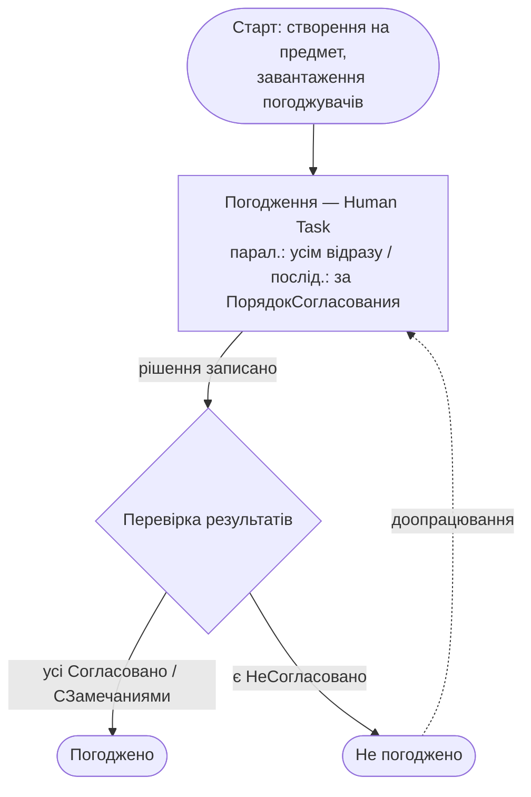

# Батч 009 — пілот BP→Workflow: Согласование (Погодження)

Пілот Шару 2 (`docs/businessprocess-workflow.md`): реконструкція маршруту
`BusinessProcess.Согласование` як **APEX Workflow 26.1** (доступний на стенді:
26.1.0, `WWV_FLOW_WORKFLOW`, 11 `APEX_APPL_WORKFLOW*` views).

## Шар 1 — стан/дані (встановлено, 0 INVALID)

`gen_document_batch --only BusinessProcess.Согласование,Task.ЗадачаИсполнителя` →
**11 таблиць / 101 колонка / 23 FK** (ddl.sql):
- `RSD_SOGLASOVANIE` (+7 ТЧ) — екземпляри процесу; ключові ТЧ:
  **`_ISPOLNITELI`** (погоджувачі: Исполнитель Роль|Користувач, ПорядокСогласования,
  Пройден, ЗадачаИсполнителя), **`_REZULTATYSOGLASOVANIYA`** (рішення).
- `RSD_ZADACHAISPOLNITELYA` (+2 ТЧ) — робочі завдання (work items) для IR
  «Мої задачі»; Предмет/ТекущийИсполнитель поліморфні (REF_TYPE/REF_ID),
  СостояниеБизнесПроцесса→RSD_ENUMS.

## Шар 2 — маршрут (реконструйовано; графічної карти немає в дампі)

**Джерела реконструкції:**
- `ВариантСогласования` ∈ {Последовательно, Параллельно, Смешанно} — режим.
- ТЧ `Исполнители.ПорядокСогласования` (порядок), `.Пройден` (крок завершено).
- `РезультатыСогласования` ∈ {Согласовано, СогласованоСЗамечаниями, НеСогласовано}
  (керує переходами; усі в RSD_ENUMS); `СостоянияБизнесПроцессов` {Активен/Остановлен/Прерван}.
- **BSL-обробники підтверджують маршрут** (імена нижче §9): `СтартПередСтартом` →
  `СогласоватьПередСозданиемЗадач` (створення задач) → `ЗавершениеПриЗавершении`,
  `ПовторитьСогласованиеПроверкаУсловия`/`УсловиеОбходЗавершен` (умова повтору/обходу).

### Маршрут

### APEX Workflow-визначення (для Workflow Designer / app-import)

**Workflow `SOGLASOVANIE`.** Variables: `P_PREDMET_TYPE`/`P_PREDMET_ID` (документ,
поліморф), `P_SOGLASOVANIE_ID`, `ROUTING_MODE`, `RESULT`.

| Activity | Тип APEX Workflow | Логіка |
|---|---|---|
| `START` | Execute Code | завантажити погоджувачів з `RSD_SOGLASOVANIE_ISPOLNITELI`; state=Активен |
| `APPROVE` | **Human Task** (parallel/serial за ROUTING_MODE) | учасники=`ISPOLNITELI.ISPOLNITEL`; рішення→`_REZULTATYSOGLASOVANIYA`; строк=СрокИсполнения |
| `CHECK` | Switch | `count(НеСогласовано)` над `_REZULTATYSOGLASOVANIYA` |
| `APPROVED` | Execute Code → End | RESULT=Согласовано; оновити предмет; state=Завершен |
| `REJECTED` | Execute Code → End | RESULT=НеСогласовано; повернути автору |

| Transition | Умова |
|---|---|
| START → APPROVE | безумовно |
| APPROVE → CHECK | по завершенню задач(і) |
| CHECK → APPROVED | `not exists РезультатыСогласования='НеСогласовано'` |
| CHECK → REJECTED | `exists РезультатыСогласования='НеСогласовано'` |

**Participants:** Human Task `APPROVE` → potential owners з `ISPOLNITELI.ISPOLNITEL`
(Роль→group, Користувач→user). **Task Definition** → `RSD_ZADACHAISPOLNITELYA`.

## Межа автоматизації (чесно)

Шар 1 — встановлено й перевірено. Шар 2 — **специфікація, готова до складання**.
Саме визначення APEX Workflow (activities/transitions) тут **не авторилося**: у
APEXLang немає підтвердженої граматики workflow-движка (компонента `workflow` немає
у компіляторних ассетах скіла), design-time `WWV_FLOW_WORKFLOW` — внутрішній.
Складається у **Workflow Designer** (App Builder, інтерактивно) за цією
специфікацією — крок власника (логін в App Builder). Runtime — `apex_workflow`.

## Тиражування

Карта (Старт → Human Task погодження → Switch за рішеннями → Погоджено/Ні) — шаблон
і для Утверждение/Рассмотрение/Ознакомление/Регистрация (ті самі ТЧ Исполнители +
Результаты*). Комплексний процес (динамічні Этапы) — окремо.

## §9 — на ревю (структура)

- Композитні (REF_TYPE/REF_ID): Предмет/Исполнитель/ТекущийИсполнитель/ШаблонОснование — 10.
- Нетипізовані (характеристики, drop): Значение, *ОбъектАдресации — 8.
- BSL-обробники: `RSD_SOGLASOVANIE` — 43 (логіка маршруту), `RSD_ZADACHAISPOLNITELYA` — 13.
  Ключові маршрутні: СтартПередСтартом, СогласоватьПередСозданиемЗадач,
  ОзнакомитьсяПередСозданиемЗадач, ЗавершениеПриЗавершении, ТочкиМаршрутаТекущихЗадач,
  ПовторитьСогласованиеПроверкаУсловия, УсловиеОбходЗавершен → Execute-Code activities.
