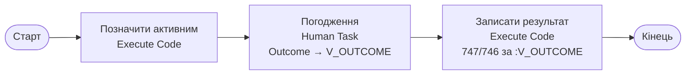

# Батч 013 — складання APEX Workflow «SOGLASOVANIE» у Designer

Шар 2 пілота (продовження `009-workflow-soglasovanie`): **робоче визначення** APEX
Workflow 26.1 за реконструйованим маршрутом. Батч 009 дав специфікацію; тут —
**рецепт складання** в App Builder Workflow Designer (app 200 «BUDYNKY», схема
`BAS_REVERSE`) + вся SQL-обв'язка + наскрізний тест.

> **Спосіб** (рішення власника): рецепт складаєш ти в Designer; я підготував точні
> значення полів і SQL. Логін в App Builder — твоє дійство (мені заборонено вводити
> паролі у форми). Після складання **фіксуємо в репо експортом app 200 в SQL**.

> ⚠️ **Уточнення (після вивчення мануала — скіл `apex-workflow`).** Рецепт нижче —
> «лінійний + вибір рішення у коді» з власною змінною `V_OUTCOME`. Це **робочий fallback**,
> але **не нативний** спосіб. Канонічно: `Human Task - Create` активність САМА створює змінні
> `TASK_OUTCOME`/`APPROVER`, а гілкування робить активність `Switch` (`Check Workflow Variable`
> = `TASK_OUTCOME`, гілки `= APPROVED` / `= REJECTED`). Зв'язки бувають ще й `Timeout` (не лише
> `Normal`/`Error`). Оновлений шаблон — `.claude/skills/apex-workflow/references/build-and-code-first.md`.

## Важливо: workflow — окремий SQL-трек

APEXLang (джерело правди `applications/budynky/`) **не тримає** визначення workflow —
у компіляторі скіла немає такого компонента (перевірено). Тобто реімпорт app з `.apx`
його **зітре**. Тому цей workflow живе не в `applications/budynky/`, а окремим
**SQL-експортом app 200** (розділ «Фіксація»). Так само на стенді підтверджено повний
app-import API (`wwv_flow_imp_shared.create_workflow*`) — тобто у майбутньому workflow
можна й авторити як код (окремий трек), але зараз — через Designer.

## Маршрут (реконструйовано, 009)

Маршрут **лінійний** (зв'язки в APEX мають лише Type `Normal`/`Error` — гілкувати на
них не можна, і Human Task має лише один вихід `Normal`). Human Task кладе результат у
змінну **`V_OUTCOME`** (`APPROVED`/`REJECTED`), а остання активність за нею обирає 747/746:



Прив'язка версії до **`RSD_SOGLASOVANIE`** (PK `ID`) → в активностях доступні
bind-змінні рядка: `:ID`, `:NAIMENOVANIE`, `:SOSTOYANIE_ID`,
`:REZULTATSOGLASOVANIYA_ID`, `:AVTOR_ID` …

Значення enum'ів (живі, `RSD_ENUMS`) — у [`sql/build-blocks.sql`](sql/build-blocks.sql).

---

## Порядок складання (по кроках)

Формат: **поле → що ввести**. Блоки коду `[C.*]` — у
[`sql/build-blocks.sql`](sql/build-blocks.sql) (копіювати дослівно).

### 0. Передумови
- App Builder → відкрити app **200** → вгорі **Shared Components** (іконка «кубики»).
- Дані вже є: 500 процесів (стор. 11 «Погодження»).

### A. Task Definition «Погодження»
Shared Components → **Task Definitions**.

> **Якщо «Погодження» вже є у списку — НЕ створювати вдруге** (буде помилка «name is
> already taken»). Клацнути по ньому й перейти до звірки полів нижче.

**Створення з нуля** — кнопка **Create** → діалог «Create Task Definition» одразу питає:
- **Name** → `Погодження`
- **Type** → `Approval Task`
- **Subject** → `Погодження: &NAIMENOVANIE.`  *(обов'язкове вже тут)*
- **Priority** → `3-Medium`
- **Potential Owner** / **Business Admin** → можна лишити порожнім (учасників додамо в редакторі)
- → **Create**. Відкриється повна форма (вкладки нижче).

Далі у формі (вкладка **Settings**):
- **Type** → `Approval Task`  *(обирається при створенні; дає 2 результати: Approved / Rejected)*
- **Initiator Can Complete** → вимкнено (off)
- **Subject** → `Погодження: &NAIMENOVANIE.`
- **Priority** → `3-Medium`
- **Task Details Page Number** → лишити порожнім  *(для тесту не треба)*
- **Actions Source** → `None`

Секція **Deadline**:
- **Due On Type** → `None`

Секція **Participants** (кнопка «Add Participant») — два рядки:
- **Participant Type** `Potential Owner` · **Identity Type** `User` · **Value Type** `Static` · **Value** `CLAUDE`
- те саме, **Value** `VIKTOR`

Секції **Parameters** і **Actions** → порожні *(для Approval Task кнопки Approve/Reject вбудовані — додавати нічого не треба)*.

Секція **Advanced**:
- **Static ID** → **перезаписати на `TASK_SOGLASOVANIE`** ⚠️
  APEX сам підставив кирилицю `погодження` — так **ламається** і не збігається зі
  скриптом тесту. Ввести латиницею.

→ натиснути **Apply Changes**.

### B. Workflow «SOGLASOVANIE» — створити

> ⚠️ **Це ІНШЕ меню, не Task Definitions!** Workflow і Task Definition — дві різні
> речі: Task Definition (розділ A) — це «картка задачі», а Workflow — сам маршрут.
> Повернутися: **Shared Components** (вгорі) → знайти пункт **Workflows** (у групі
> «Workflows and Automations»), НЕ «Task Definitions».

У **Workflows** → кнопка **Create** → у діалозі:
- **Name** → `Погодження`
- якщо є поле **Static ID** — одразу ввести `SOGLASOVANIE` (латиниця!). Якщо його в
  діалозі немає — виправимо після створення (нижче).
- **Create** → відкриється Workflow Designer (порожня канва з вузлом Start).

Виправити Static ID (якщо не було в діалозі): клацнути назву workflow у дереві зліва
(або фон канви) → права панель → поле **Static ID** = `SOGLASOVANIE` (латиниця, бо
APEX підставляє кирилицю — та сама пастка, що й у Task Definition).

Прив'язати джерело даних: клацнути **фон канви / корінь workflow** → права панель,
секція **Source** (або «Query»):
- **Source Type / Query Type** → `Table`
- **Table** → `RSD_SOGLASOVANIE`
- **Primary Key Column** → `ID`
Це дає в активностях bind-змінні рядка процесу: `:ID`, `:NAIMENOVANIE`, `:SOSTOYANIE_ID` …

> Якщо діалог Create **не зберігається** — глянь, яке поле підсвічене червоним, або
> скинь скрін діалогу «Create Workflow»: звіримо поля разом (як робили з Task Definition).

Потрібна **одна змінна**: дерево зліва → **Variables** → Create → **Static ID**
`V_OUTCOME`, **Data Type** `VARCHAR2`. (Зайві змінні від попередніх спроб — видалити.)

### C. Активності — на канві (палітра «Activities» внизу екрана)
Три активності (у кожної: **Name** + **Type** + поля):

**C1. «Позначити активним»** — наявний вузол (Execute Code). Клацнути:
- **Name** → `Позначити активним`
- **PL/SQL Code** → блок `[C.START]`

**C2. «Погодження»** — Type **Human Task - Create**:
- **Name** → `Погодження`
- **Human Task → Definition** → `Погодження`
- **Human Task → Details Primary Key Item** → `ID`
- **Result → Outcome** → `V_OUTCOME`  ← сюди Human Task кладе `APPROVED`/`REJECTED`
  *(обрати змінну через іконку-список біля поля; НЕ вписувати текст вручну)*
- **Result → Owner** → порожньо

**C3. «Записати результат»** — Type **Execute Code** (єдина після «Погодження»):
- **Name** → `Записати результат`
- **PL/SQL Code** → блок `[C.RECORD]`  *(сам обере 747/746 за `:V_OUTCOME`)*

> Якщо лишилися «Погоджено»/«Відхилено» від гілкованої спроби — лиши ОДНУ
> (перейменуй на «Записати результат», встав `[C.RECORD]`), другу **видали**.

### D. Переходи — лінійно (усі зв'язки Type = Normal)
Один шлях, без гілок:
```
Start → Позначити активним → Погодження → Записати результат → End
```
- Усі зв'язки — **Type = Normal** (APPROVED/REJECTED на зв'язках не буває — це нормально).
- **У «Погодження» має бути РІВНО ОДИН вихід** (Normal). Дві вихідні стрілки з Human
  Task = помилка (саме через це не зберігалося). Зайву стрілку видали.

### E. Учасник-власник → зберегти → активувати
1. **Owner для версії** (інакше активація дає «Version must have at least one Owner»).
   У дереві версії клацнути **Participants** → створити учасника:
   - **Name** → `Owner` (будь-який ярлик)
   - **Type** → `Workflow Owner`
   - **Value → Type** → `Static Value`
   - **Value → Static Value** → `VIKTOR`  ← обов'язкове (порожнє = не зберігається)
2. **Save**.
3. **Activate** версію (Settings → State → **Activate**) — без цього `start_workflow`
   не стартує (версія має бути Active, не Development).

---

## Тест (наскрізний, headless) — ✅ ПРОЙДЕНО

[`sql/pilot-test.sql`](sql/pilot-test.sql) на процесі **ID=94** відпрацьовує наскрізь:
старт (initiator CLAUDE) → задача → **VIKTOR** APPROVED → рушій доробляє →
`REZULTATSOGLASOVANIYA_ID=747` + новий рядок ТЧ `_REZULTATYSOGLASOVANIYA`, екземпляр
**COMPLETED**. Запуск — **під BAS_REVERSE** (не sysdba; рантайму потрібен APEX-контекст):

```bash
ssh apex-vps "docker exec -i apex-ords /opt/oracle/sqlcl/bin/sql \
  BAS_REVERSE/<pwd>@//db:1521/FREEPDB1" < sql/pilot-test.sql
# <pwd> — /root/apex-credentials.txt, рядок 'schema BAS_REVERSE', поле 4
```

**Три уроки, зашиті в тест** (без них «не спрацювало»):
1. **Завершує НЕ-ініціатор.** Ініціатор (CLAUDE) заблокований `Initiator Can Complete=OFF`
   (розділення обов'язків) → `ORA-20987` «не авторизовано». Стартуємо CLAUDE, погоджує VIKTOR.
2. **Задача створюється асинхронно** після `start_workflow` → не брати `max(task_id)` наосліп;
   запам'ятати baseline і опитувати появу нової (`task_id > baseline`).
3. **Продовження після complete теж асинхронне** → опитувати екземпляр до `COMPLETED`, потім читати рядок.

Альтернатива — UI: App Builder → **Monitor Activity** (інстанси/задачі), або сторінка з
Unified Task List, де задача реально з'явиться в інбоксі CLAUDE/VIKTOR.

## Фіксація в репо (обов'язково — workflow не в APEXLang!)

Після робочого тесту зберегти визначення в репо **SQL-експортом** (не APEXLang):

```bash
# SQLcl усередині ORDS, під BAS_REVERSE:
apex export -applicationid 200 -expType APPLICATION_SOURCE -dir <d>
# або з UI: App Builder → Export → Application (Format: SQL)
```

Покласти отриманий `f200.sql` (або workflow-фрагмент `create_workflow*`) у
`migration/013-workflow-soglasovanie-build/export/`. Це стане артефактом-істиною Шару 2.

## Межі (чесно)

- **Учасники — пілотна заглушка.** Потенційні власники = статичні CLAUDE/VIKTOR, бо
  реальні виконавці не мапляться на APEX-акаунти: `Catalog.ПолныеРоли` (736/843) **не
  мігровано** (ref-ext), `Catalog.Пользователи` → `RSD_POLZOVATELI`, але
  `IDENTIFIKATORPOLZOVATELYAIB` ще не звірено з APEX-логінами (немає identity-bridge).
  Продакшн-запит — коментар `[A]` у build-blocks.
- **Немає стану «Завершено».** `СостоянияБизнесПроцессов` має лише 768/769/770
  (Активний/Зупинений/Перерваний). Завершення виражаємо результатом
  (`REZULTATSOGLASOVANIYA_ID`) + `DATAZAVERSHENIYA`, не станом.
- **Два результати замість трьох.** Тип задачі — `Approval Task` (вбудовані
  Approved/Rejected). Тому `РезультатыСогласования` пілот пише 747 (Погоджено) або 746
  (Не погоджено); **748 «Погоджено із зауваженнями» не використовується** — для нього
  потрібен кастомний тип задачі з 3-м результатом (наступний виток).
- **Спрощення маршруту.** Пілот — один Human Task на процес (не мультиінстанс за
  `ВариантСогласования`: 188 По черзі / 189 Всім відразу / 190 Змішано). Серійне/
  паралельне погодження за `ISPOLNITELI.ПорядокСогласования` + повторні ітерації
  (`ПовторитьСогласование`, `КоличествоИтераций`) — наступний виток (activity
  `NATIVE_PARALLEL_WF`).
- **43 BSL-обробники** процесу не транслювались 1:1 — маршрут реконструйовано зі
  структури + enum'ів (009).

## Тиражування

Карта (Старт → Execute Code → Human Task → Execute Code «результат» → Кінець) — шаблон
для **Утверждение / Рассмотрение / Ознакомление / Регистрация** (ті самі ТЧ Исполнители +
Результаты*). `КомплексныйПроцесс` (динамічні Этапы, 56 обробників) — окремо.
